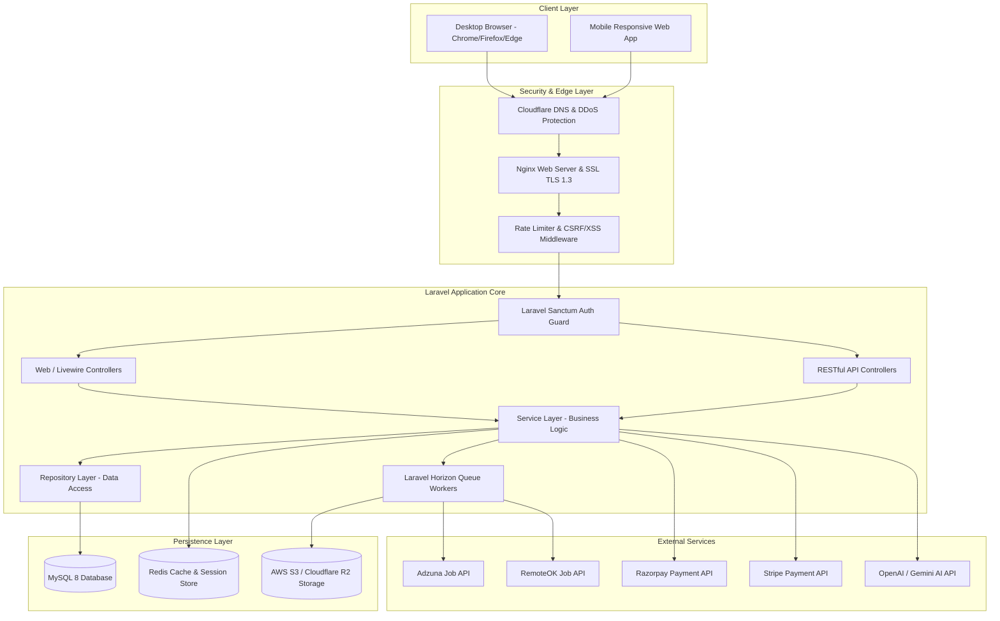
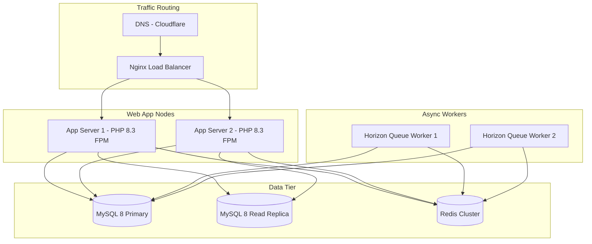

# System Architecture Specification - SkillBridge

## 1. High-Level Architecture Diagram

---

## 2. Layered Architecture Pattern

The system follows the **Controller - Service - Repository** pattern in Laravel:

- **Http Controllers** (`app/Http/Controllers`): Handles incoming request validation, middleware checks, and maps service outputs to HTTP responses.
- **Service Layer** (`app/Services`): Encapsulates pure business logic (e.g., `PaymentService`, `AIService`, `CertificateService`, `JobSyncService`).
- **Repository Layer** (`app/Repositories`): Abstracts database queries using Eloquent ORM, ensuring testability and clean query separation.
- **Queue Workers** (`app/Jobs`): Offloads asynchronous tasks (sending emails, processing webhooks, fetching external jobs, generating PDF certificates) via Laravel Horizon and Redis queues.

---

## 3. Security Architecture & Audit System

1. **Authentication**: Token-based authentication via Laravel Sanctum for API endpoints; session-based guard for Web/Livewire routes.
2. **Authorization**: Custom `CheckRole` middleware enforcing access gates for the 7 user roles (`super_admin`, `admin`, `trainer`, `student`, `recruiter`, `company_admin`, `guest`).
3. **Audit Logging**: Sensitive system events automatically write to the `audit_logs` database table tracking actor ID, action name, IP address, user agent, and JSON payload diffs.
4. **File Upload Security**: All file uploads (resumes, course resources, logos) undergo strict MIME verification, filesize limits, and randomized S3 object keys to prevent arbitrary script execution.

---

## 4. Deployment & Infrastructure Architecture

