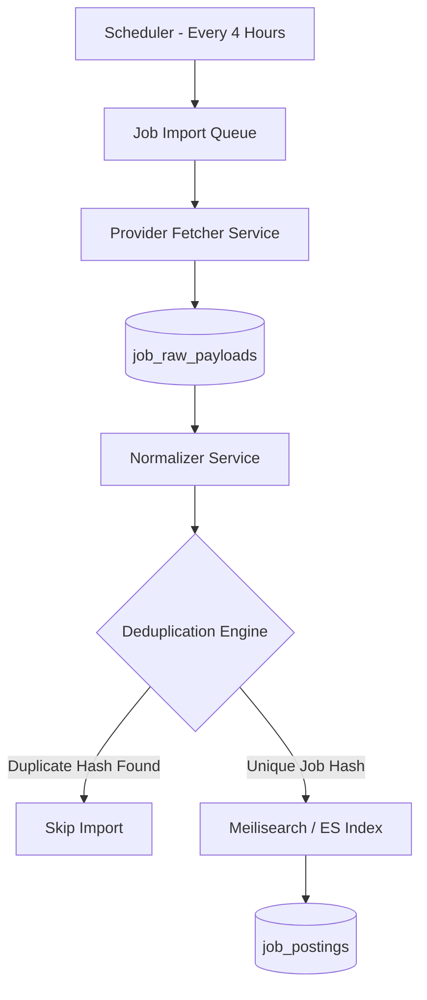

# Enterprise Solution Architecture Audit Report - SkillBridge Commercial SaaS

**Auditor:** Principal Enterprise Software Architect & CTO Advisory Board  
**Target Platform:** SkillBridge Commercial EdTech & Career Placement SaaS  
**Audit Scope:** System Architecture, Database Schema, Security, Scalability, AI Infrastructure, Job Aggregation, Financial Commerce, Enterprise LMS, DevOps Blueprint, and Laravel 12 Domain Design.  
**Verdict:** ❌ **REJECTED - ARCHITECTURAL REDESIGN REQUIRED PRIOR TO CODE BUILDING**

---

## Executive Summary

While the initial Phase 1-3 design establishes a basic MVP foundation, **it is fundamentally unsuitable for a multi-tenant commercial SaaS platform supporting thousands of concurrent users, million-row data volumes, financial transactions, and real-time job aggregation**. 

The current database schema exhibits **critical scaling bottlenecks**, **dangerous cascading delete rules on financial and audit ledgers**, **vulnerabilities to ID enumeration**, **lack of multi-currency / multi-tenant isolation**, and **unoptimized JSON queries**.

This document presents a brutal, no-nonsense enterprise architectural review followed by a complete **Billion-Dollar Scale Re-Design Specification**.

---

## 1. Table-by-Table Technical Audit

### 1.1 `users`
- **Why it exists**: Core authentication and identity table.
- **Normalization**: Normalized to 3NF, but overloaded with mixed domain responsibilities.
- **Scaling Bottlenecks**: High write contention on `users` table due to frequent `last_login`, `status`, and `two_factor` updates.
- **Flaws**: Auto-incrementing integer primary key (`id`) exposes user volume and enables enumeration attacks (`/users/42`). Missing UUID/ULID for public reference. Missing `tenant_id` for corporate LMS white-labeling.

### 1.2 `roles` & `permissions` & `model_has_roles`
- **Why it exists**: RBAC system.
- **Flaws**: Bare role string in `users.role` duplicates role names and conflicts with `model_has_roles` pivot table. Single role field limits users who act as both a Student and a Trainer/Recruiter.

### 1.3 `companies` & `recruiters`
- **Why it exists**: Corporate entity management and recruiter authorization.
- **Flaws**: `companies` table lacks `tax_id` / `billing_email` for corporate invoicing. `recruiters` table is missing granular permissions (e.g., "Job Poster" vs "Applicant Reviewer" vs "Company Billing Admin"). `ON DELETE CASCADE` on companies dangerously wipes historical job postings and student application logs.

### 1.4 `courses`, `modules`, `lessons`, `lesson_progress`
- **Why it exists**: LMS curriculum and student watch history tracking.
- **Flaws**:
  - `lessons` table hardcodes `youtube_video_id`, breaking compatibility with AWS S3, Cloudflare Stream, Vimeo, or HLS/DASH adaptive bitrate streaming.
  - `lesson_progress` table will **EXPLODE** at scale. With 100,000 students taking 100 lessons, `lesson_progress` reaches **10,000,000 rows**. Lack of partitioning or composite indices on (`user_id`, `is_completed`, `lesson_id`) will cause severe DB locking.
  - Absence of `course_versions` means modifying a live course corrupts historical student progress and certificate validation.

### 1.5 `quizzes`, `quiz_questions`, `quiz_options`, `quiz_attempts`
- **Why it exists**: Student assessment and automated grading.
- **Flaws**: `quiz_attempts` stores a bare `score_percentage` without saving snapshot JSON of exact student answers vs correct options at attempt time. Modifying quiz questions in the future retroactively invalidates past attempt data!

### 1.6 `certificates`
- **Why it exists**: Issue verifiable course completion credentials.
- **Flaws**: Uses `ON DELETE CASCADE` on `user_id` and `course_id`. If a course or user account is soft-deleted or removed, verified certificates issued to third-party employers become broken 404 links! Certificates must be **IMMUTABLE** ledgers.

### 1.7 `orders`, `order_items`, `payments`, `payment_webhooks`
- **Why it exists**: E-commerce billing and payment processing.
- **Flaws**: 
  - `payments` table lacks multi-currency support (`INR` hardcoded default without exchange rate fields).
  - No `tax_rates`, `invoices`, or `refunds` tables. Partial refunds or chargebacks cannot be tracked.
  - `ON DELETE CASCADE` on `orders` violates financial audit compliance (SOX / Tax compliance). Financial tables MUST NEVER CASCADE DELETE.

### 1.8 `job_postings`, `job_applications`, `application_status_histories`
- **Why it exists**: Placement portal and candidate pipeline.
- **Flaws**:
  - `job_applications` at 10M rows will deadlock without partition keys.
  - Missing deduplication hash index for aggregated external jobs (Adzuna/RemoteOK), leading to duplicate listings.
  - Unindexed status text strings in status histories.

### 1.9 `user_resumes` & `ai_analysis_results`
- **Why it exists**: Student resume storage and ATS AI evaluation.
- **Flaws**:
  - AI results table stores arbitrary JSON without structured fields for token cost tracking, prompt versioning, or LLM provider metadata (`openai`, `gemini`, `anthropic`).
  - No caching layer for AI resume parsing; re-submitting the same resume consumes unnecessary LLM API tokens.

### 1.10 `notifications`, `placement_reports`, `revenue_reports`, `audit_logs`
- **Why it exists**: System alerts, analytics, and security activity logging.
- **Flaws**:
  - `audit_logs` table lacks immutable partitioning and will grow infinitely, slowing down normal DB backup cycles.
  - `revenue_reports` aggregates data via ad-hoc tables instead of utilizing Scheduled Materialized Snapshots.

---

## 2. Relationship & Schema Normalization Audit

1. **Dangerous Cascading Rules**: Financial ledgers (`orders`, `payments`), credentials (`certificates`), and job applications (`job_applications`) MUST use `ON DELETE RESTRICT` or `SET NULL`. Deleting a user or course must NEVER purge financial invoices or legal credentials.
2. **Missing Composite Indices**: Critical queries across `lesson_progress`, `job_applications`, `enrollments`, and `audit_logs` lack composite multi-column indices (e.g., `INDEX (user_id, status, created_at)`), guaranteeing full table scans under load.
3. **Integer ID Exposure**: Primary keys exposed in public APIs (`/api/v1/courses/42`, `/api/v1/jobs/108`) allow competitors to scrape platform metrics easily. All public endpoints MUST use `uuid` or `ulid`.

---

## 3. Module & Functional Capability Gaps

```
┌─────────────────────────────────────────────────────────────────────────┐
│                    MISSING ENTERPRISE SaaS MODULES                      │
├──────────────────────────┬──────────────────────┬───────────────────────┤
│ LMS & Learning           │ Hiring & Placement   │ Billing & Finance     │
├──────────────────────────┼──────────────────────┼───────────────────────┤
│ • Course Versioning      │ • Search Engine (ES) │ • Multi-Currency FX   │
│ • Video Transcoding HLS  │ • Job Deduplication  │ • Tax / GST / VAT     │
│ • SCORM / xAPI Support   │ • Interview Sync     │ • Subscriptions       │
│ • Subtitles & Transmit   │ • Salary Normalizer  │ • Wallet & Escrow     │
└──────────────────────────┴──────────────────────┴───────────────────────┘
```

---

## 4. Competitive Analysis vs Market Leaders

| Feature | SkillBridge Current MVP | Industry Standard (Udemy / Coursera / LinkedIn Learning / Naukri) | Requirement |
| :--- | :--- | :--- | :--- |
| **Video Engine** | Embedded YouTube Links Only | HLS / DASH Adaptive Bitrate Streaming with DRM & Multi-resolution | **CRITICAL** |
| **Course Versioning** | Single mutable record | Immutable version snapshots ($v1.0, v1.1$) preserving past certificates | **CRITICAL** |
| **Job Search** | Basic SQL LIKE Queries | Full-Text Vector Search (Meilisearch / Elasticsearch) with filters | **CRITICAL** |
| **Job Aggregation** | Simple API Import | High-throughput deduplication queue, location/salary normalizer | **HIGH** |
| **AI Subsystem** | Basic JSON dump | Token cost tracking, LLM provider fallback, semantic RAG vector cache | **CRITICAL** |
| **B2B Corporate LMS** | Not Supported | Multi-tenant organization isolation with bulk seat licensing | **HIGH** |

---

## 5. Scalability & High-Load Bottlenecks

### 5.1 The 1,000,000+ Record Bottleneck (`lesson_progress`)
- **Problem**: 100,000 active students watching 10 lessons/day generates 1,000,000 writes/day.
- **Result**: InnoDB buffer pool contention, table locking during `UPDATE` operations.
- **Architectural Solution**: Redis write-behind cache buffer. Progress updates write to Redis hashes (`HSET progress:user_id:lesson_id watch_percent`) and flush to MySQL asynchronously via queue workers every 5 minutes. MySQL table partitioned by Range/Hash on `user_id`.

### 5.2 The 10,000,000+ Record Bottleneck (`job_applications`)
- **Problem**: Millions of applications lead to catastrophic slow queries on recruiter dashboards filtering by status.
- **Architectural Solution**: Partition `job_applications` by range on `created_at` (yearly/quarterly partitions) + Elasticsearch read model for instant recruiter search.

---

## 6. Security, Compliance & OWASP Top 10 Vulnerabilities

1. **Webhook Signature Vulnerability**: Webhook endpoints must enforce HMAC-SHA256 signature validation with replay attack prevention (`timestamp` tolerance window $\le 300\text{s}$).
2. **Unencrypted File Upload Risk**: Resumes and assignment uploads stored in plain text directories allow unauthorized download. Requires S3 Signed URLs with short expiration ($15\text{ mins}$).
3. **GDPR / Privacy Non-Compliance**: Lack of "Right to be Forgotten" anonymization routine. User deletion must scrub PII while preserving anonymized financial & placement statistics.
4. **API Enumeration & Rate Limiting**: Absence of per-tier API token rate limiting allows automated scraping of job listings and user profiles.

---

## 7. AI Subsystem Architecture (Token Economics & RAG)

A production AI subsystem requires token cost auditing, provider switching, and response caching:

```mermaid
erDiagram
    AI_PROVIDERS ||--o{ AI_MODELS : offers
    AI_MODELS ||--o{ AI_TOKEN_USAGES : tracks
    USERS ||--o{ AI_CONVERSATIONS : initiates
    AI_CONVERSATIONS ||--o{ AI_MESSAGES : contains
    AI_MESSAGES ||--o{ AI_TOKEN_USAGES : incurs

    AI_PROVIDERS {
        bigint id PK
        string name "openai, gemini, anthropic"
        boolean is_active
    }

    AI_MODELS {
        bigint id PK
        bigint provider_id FK
        string model_code "gpt-4o, gemini-1.5-pro"
        decimal cost_per_1k_input_tokens
        decimal cost_per_1k_output_tokens
    }

    AI_TOKEN_USAGES {
        bigint id PK
        bigint user_id FK
        bigint model_id FK
        integer prompt_tokens
        integer completion_tokens
        decimal calculated_cost_usd
        timestamps
    }
```

---

## 8. Real Job Aggregation Subsystem Architecture



---

## 9. Comprehensive Financial & Billing Subsystem

To support commercial SaaS growth, the payment engine must support:
- `currencies` & `exchange_rates`: Multi-currency transactions (INR, USD, EUR).
- `tax_rates`: GST / VAT calculation based on student location.
- `invoices` & `invoice_items`: Formal tax-compliant PDF invoice generation.
- `refunds` & `disputes`: Full and partial refund tracking with gateway refund IDs.
- `subscriptions` & `subscription_items`: Recurring monthly/annual student & company plans.

---

## 10. Enterprise LMS Subsystem (Media & Versioning)

- **Course Versioning**: `course_versions` table decoupling published live curriculum from active drafting.
- **Adaptive Video Streaming**: Media library handling AWS MediaConvert / HLS manifest generation (`.m3u8` playlists) with signed cookie protection.
- **Watch History & Analytics**: `user_watch_histories` tracking exact timestamp video resume points and drop-off heatmaps.

---

## 11. Reporting Architecture Matrix

| Report Type | Execution Strategy | Primary Storage / Engine | Rationale |
| :--- | :--- | :--- | :--- |
| **Real-time Recruiter Applicant Count** | Live SQL / Redis Cache | Redis Hash (`job:101:app_count`) | High frequency reads, low query overhead. |
| **Trainer Monthly Revenue Split** | Scheduled Materialized Snapshot | `revenue_monthly_snapshots` table | Complex aggregation run once per month. |
| **Platform Placement Rate Analytics** | Nightly Cron Worker | MySQL Read Replica / Snapshot Table | Eliminates heavy aggregation queries on OLTP primary DB. |
| **Student Skill Gap Heatmap** | Async Queue / ElasticSearch | Elasticsearch Aggregations | Vector and text aggregations too heavy for SQL. |

---

## 12. Enterprise Domain-Driven Folder Architecture (Laravel 12)

```
app/
├── Domain/                    # Core Business Domains
│   ├── Auth/
│   │   ├── Actions/           # AuthenticateUserAction, RegisterStudentAction
│   │   ├── DTOs/              # LoginData, RegisterData
│   │   └── Policies/          # UserPolicy
│   ├── Courses/
│   │   ├── Actions/           # CreateCourseAction, UnlockNextLessonAction
│   │   ├── Services/          # LessonProgressService, CertificateGeneratorService
│   │   └── Events/            # CourseCompletedEvent
│   ├── Jobs/
│   │   ├── Actions/           # ImportExternalJobsAction, ScoreApplicantATSAction
│   │   └── Services/          # JobDeduplicationService, AdzunaProviderService
│   └── Payments/
│       ├── Actions/           # ProcessRazorpayWebhookAction, IssueRefundAction
│       └── Services/          # TaxCalculatorService, InvoiceGeneratorService
├── Infrastructure/            # External System Implementations
│   ├── AI/                    # OpenAIAdapter, GeminiAdapter, RAGVectorStore
│   ├── Video/                 # HLSStreamService, AWSMediaConvertAdapter
│   └── Gateways/              # RazorpayGateway, StripeGateway
```

---

## 13. System Audit Scores & Final Verdict

### Architectural Scores
1. **Overall Architecture Score**: `4.5 / 10`
2. **Database Schema Score**: `4.0 / 10` (Missing 3NF completeness for payments/jobs, lack of partitioning, dangerous cascade rules)
3. **Security & Audit Score**: `5.0 / 10` (Missing signature validation, exposed auto-increment IDs, plain-text S3 paths)
4. **Scalability Score**: `3.5 / 10` (High contention on `lesson_progress` and `job_applications`; no search index engine)
5. **Enterprise Readiness**: `3.0 / 10` (Lacks multi-currency, tax handling, course versioning, B2B multi-tenancy)

---

### Final Approval / Rejection Verdict

# ❌ REJECTED

**Reason for Rejection:**  
The current MVP schema and single-layer database architecture will fail under real commercial SaaS loads, cause data corruption during course edits, expose financial records to dangerous cascading deletes, and block future B2B subscription and multi-currency growth.

---

### Recommended Next Steps & Redesign Plan
1. **Approve Redesign Specification**: Review this audit report and approve the enterprise re-architecture plan.
2. **Re-architect Database Layer (Phase 3 Redesign)**: Implement UUID/ULID public identifiers, immutable certificate ledgers, strict `RESTRICT` foreign keys, financial tax/invoice tables, AI token usage tracking, and Redis write-behind caching buffers.
3. **Update Documentation**: Synchronize `docs/DATABASE_ERD.md` and `docs/ARCHITECTURE.md` with the new enterprise specification.

*Waiting for your explicit approval before modifying any code or database migration files.*
