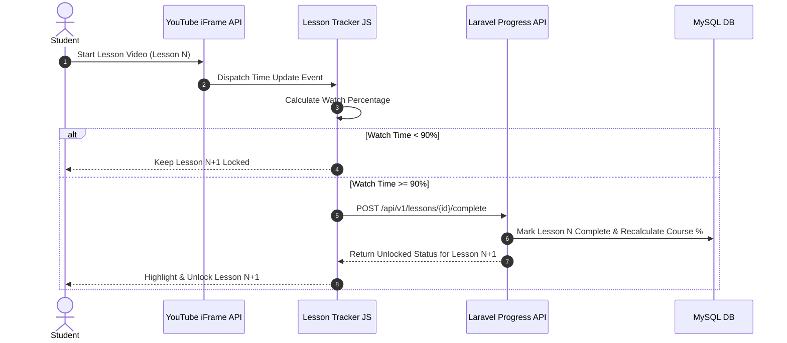
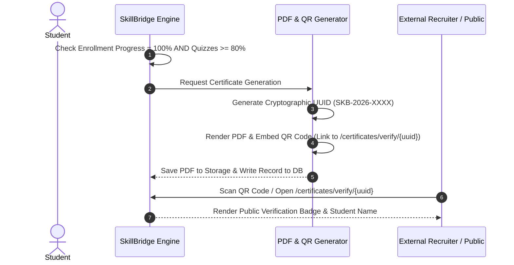

# Workflows & Integrations - SkillBridge

## 1. Sequential Lesson Progression & Video Tracking

---

## 2. Dynamic Certificate Generation & Public UUID Verification

---

## 3. External Job Sync Queue Workflow (Adzuna / RemoteOK)
- **Schedule**: Cron job triggers every 6 hours (`php artisan jobs:sync-external`).
- **Fetch**: Horizon worker dispatches HTTP requests to Adzuna REST API & RemoteOK API.
- **Deduplication**: Checks `external_id` against `job_postings` table to prevent duplicates.
- **Mapping**: Normalizes job title, location, salary range, and tags into standard `job_postings` schema with `source = 'adzuna'` or `source = 'remoteok'`.
